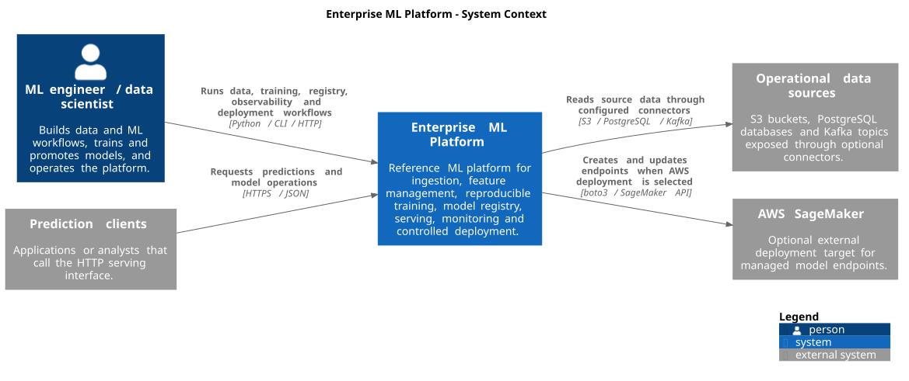
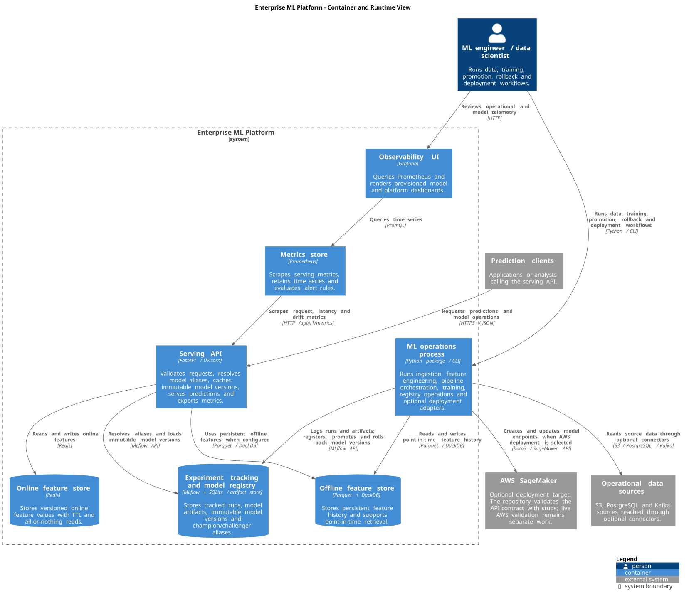
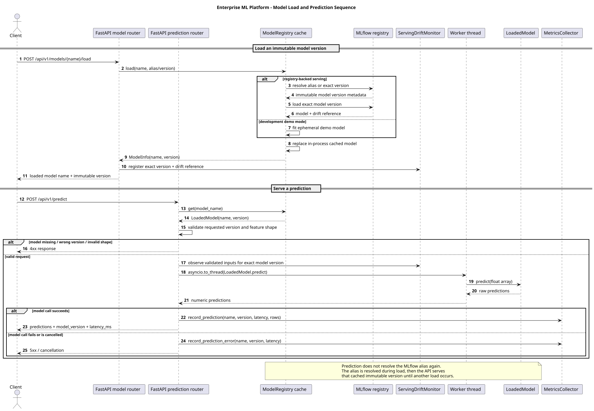

# Architecture

This repository documents architecture separately from the implementation
layout. The goal is to show runtime boundaries and responsibilities without
pretending that every package under `services/` is a separately deployed
microservice.

The diagrams use the [C4 model](https://c4model.com/) with PlantUML as the
text-as-code notation. The existing Mermaid lifecycle in `README.md` is kept
because it answers a different question: how a model moves through the
platform.

## Views

| View | Question answered | Source |
| --- | --- | --- |
| System context | Who uses the platform and which external systems does it depend on? | [`docs/architecture/context.puml`](docs/architecture/context.puml) |
| Container/runtime | Which processes and data stores exist at runtime, and how do they communicate? | [`docs/architecture/containers.puml`](docs/architecture/containers.puml) |
| Serving sequence | How is an immutable model version loaded and then used for prediction, drift observation and telemetry? | [`docs/architecture/inference-sequence.puml`](docs/architecture/inference-sequence.puml) |
| ML lifecycle | How does data become a promoted and served model? | [`README.md`](README.md#the-lifecycle-it-demonstrates) |

The `.puml` files are the editable source of truth. Their validated SVG renders
are committed under `docs/architecture/rendered/` so GitHub readers can see the
architecture directly without installing PlantUML or downloading CI artifacts.

## System context



The platform has two primary interaction modes. ML engineers and data
scientists run data, training, registry and deployment workflows. Prediction
clients call the HTTP serving interface. Optional connectors read source data
from S3, PostgreSQL and Kafka. AWS SageMaker is outside the platform boundary
and is reached only when the AWS deployment adapter is selected.

This last boundary is deliberately conservative. The SageMaker deployer is
implemented and tested against a stubbed AWS API, but the roadmap still tracks
a live AWS deployment as external validation work.

## Container and runtime boundaries



The container view models deployment and process boundaries rather than Python
package names.

| Runtime element | Implementation evidence | Responsibility |
| --- | --- | --- |
| ML operations process | [`core/pipeline_orchestrator.py`](src/enterprise_ml_platform/core/pipeline_orchestrator.py), [`services/model_training/`](src/enterprise_ml_platform/services/model_training/), [`services/data_ingestion/`](src/enterprise_ml_platform/services/data_ingestion/), [`services/model_deployment/`](src/enterprise_ml_platform/services/model_deployment/) | Runs ingestion, feature engineering, pipeline orchestration, training, registry operations and optional deployment adapters |
| Serving API | [`api/`](src/enterprise_ml_platform/api/) | Validates requests, resolves model aliases, caches immutable model versions, serves predictions and exports metrics |
| Online feature store | [`feature_store/online_store.py`](src/enterprise_ml_platform/services/feature_store/online_store.py) | Redis-backed versioned feature values with TTL and all-or-nothing reads |
| Offline feature store | [`feature_store/offline_store.py`](src/enterprise_ml_platform/services/feature_store/offline_store.py) | Parquet history queried with DuckDB for persistent point-in-time retrieval |
| Experiment tracking and registry | [`model_training/service.py`](src/enterprise_ml_platform/services/model_training/service.py), [`model_registry/mlflow_registry.py`](src/enterprise_ml_platform/services/model_registry/mlflow_registry.py) | MLflow runs, model artifacts, immutable model versions, aliases, promotion and rollback |
| Metrics store | [`monitoring/prometheus/`](monitoring/prometheus/) | Prometheus scraping, time-series retention and alert rules |
| Observability UI | [`monitoring/grafana/`](monitoring/grafana/) | Provisioned Grafana dashboards backed by Prometheus |

The local Compose topology provides concrete runtime evidence for the API,
Redis, MLflow, Prometheus and Grafana boundaries in
[`docker/docker-compose.yml`](docker/docker-compose.yml). The Python modules
under `services/` are not drawn as independent network services unless a real
process boundary exists.

## Serving sequence



The sequence view documents a subtle but important serving property. Model
aliases are resolved when a model is loaded, not on every prediction request.
The API then serves the cached immutable version until another load changes the
cache. Drift state and prediction telemetry are therefore labelled against the
same exact model version that produced the prediction.

Validation failures are rejected before the model call and do not contribute
to model error-rate telemetry. Blocking inference runs on a worker thread so an
individual model call does not block the FastAPI event loop.

## Important relationships

The serving API resolves the configured MLflow model alias once, loads the
resulting immutable model version and keeps it in an in-process cache. The same
API builds its feature-store dependency around Redis and an optional persistent
Parquet/DuckDB offline store.

Training is a separate execution path. When tracking is configured, the model
training service writes parameters, metrics, drift-reference metadata and the
model artifact inside an explicit MLflow run. Registry promotion then changes
metadata rather than redeploying the serving process.

Prometheus scrapes the API's `/api/v1/metrics` endpoint. Grafana queries
Prometheus. This makes observability a separate runtime concern rather than a
library call hidden inside inference.

## Rendering

The committed SVGs are generated from the PlantUML sources by the architecture
workflow. For local rendering with a current PlantUML installation:

```bash
plantuml -tsvg docs/architecture/context.puml
plantuml -tsvg docs/architecture/containers.puml
plantuml -tsvg docs/architecture/inference-sequence.puml
```

Or, when using the PlantUML JAR directly:

```bash
java -jar plantuml.jar -tsvg docs/architecture/context.puml
java -jar plantuml.jar -tsvg docs/architecture/containers.puml
java -jar plantuml.jar -tsvg docs/architecture/inference-sequence.puml
```

SVG is the reader-facing format because it stays sharp at different sizes. The
`.puml` files remain the source of truth.

## Deliberate omissions

This first architecture slice does not draw Kubernetes or Terraform as an
active production deployment. Those artefacts exist in the repository but
have not been applied by CI. It also does not turn thinly tested subsystems
such as distributed execution into independent containers.

A deployment diagram should be added only when it can distinguish a proven
local topology from a validated cloud topology. Component diagrams should be
added where an internal subsystem is complex enough that the extra zoom level
explains something the container view cannot.
