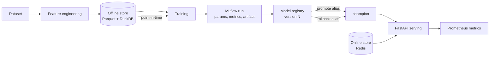

# Enterprise ML Platform

[](https://github.com/DiogoRibeiro7/enterprise-ml-platform/actions/workflows/ci.yml)
[](https://github.com/DiogoRibeiro7/enterprise-ml-platform/actions/workflows/security.yml)
[](https://opensource.org/licenses/MIT)
[](https://www.python.org/downloads/)
[](https://orcid.org/0009-0001-2022-7072)

A reference implementation of a production ML platform: reproducible training,
versioned features, a model registry with alias-based promotion, an HTTP
serving layer, and controlled deployment to SageMaker.

It is a study of how these pieces fit together, not a product. The section
below says exactly which parts are implemented and covered by tests and which
are scaffolding, because a platform that reports success it never achieved is
worse than one that admits the gap.

## What is implemented

| Capability | State | Where |
| --- | --- | --- |
| Pipeline orchestration — DAG validation, bounded concurrency, retries, circuit breaker, cancellation and compensating rollback | **Implemented, tested** | [core/pipeline_orchestrator.py](src/enterprise_ml_platform/core/pipeline_orchestrator.py) |
| Online feature store — Redis, namespaced by feature set and version, TTL, all-or-nothing reads | **Implemented, tested** | [feature_store/online_store.py](src/enterprise_ml_platform/services/feature_store/online_store.py) |
| Offline feature store — Parquet queried through DuckDB, point-in-time correctness, survives restarts | **Implemented, tested** | [feature_store/offline_store.py](src/enterprise_ml_platform/services/feature_store/offline_store.py) |
| Model registry — MLflow versions, `champion`/`challenger` aliases, promotion and rollback | **Implemented, tested** | [model_registry/mlflow_registry.py](src/enterprise_ml_platform/services/model_registry/mlflow_registry.py) |
| Experiment tracking — scoped runs, logged params, metrics and model artifacts | **Implemented, tested** | [model_training/service.py](src/enterprise_ml_platform/services/model_training/service.py) |
| Serving — FastAPI, inference off the event loop, schema validation, batch limits, version in every response | **Implemented, tested** | [api/routers/predictions.py](src/enterprise_ml_platform/api/routers/predictions.py) |
| API configuration — API key, CORS and limits from the environment, with deployment guardrails | **Implemented, tested** | [api/config.py](src/enterprise_ml_platform/api/config.py) |
| SageMaker deployment — model, endpoint config and endpoint lifecycle, traffic weights, rollback to a previous config | **Implemented, tested against a stubbed AWS API** | [deployers/aws_deployer.py](src/enterprise_ml_platform/services/model_deployment/deployers/aws_deployer.py) |
| Feature engineering — numerical, categorical and temporal transformers, with identifiers carried through untransformed | **Implemented, partially tested** | [feature_engineering/](src/enterprise_ml_platform/services/feature_engineering/) |
| Drift detection, A/B testing, streaming, resource management | Implemented, thinly tested | [services/](src/enterprise_ml_platform/services/) |
| Distributed training (Ray, Dask, Spark) | Interfaces only, no scale testing | [services/distributed/](src/enterprise_ml_platform/services/distributed/) |
| Security and compliance (RBAC, GDPR, HIPAA, PII) | Scaffolding, not an audited implementation | [security/](src/enterprise_ml_platform/security/) |
| Kubernetes manifests, Terraform modules, Grafana dashboards | Present, never applied by CI | [kubernetes/](kubernetes/), [terraform/](terraform/), [monitoring/](monitoring/) |
| Domain examples (fraud, NLP, vision, time series) | Thin wrappers, illustrative only | [examples/](examples/) |
| Deployment to GCP or Azure | **Removed.** They logged and returned a plausible URL without calling anything | — |
| Model export to ONNX and friends | **Not implemented.** Raises rather than returning a fake path | [model_exporter.py](src/enterprise_ml_platform/services/model_registry/export/model_exporter.py) |

CI runs ruff, mypy, the full test suite on Python 3.11–3.13, a packaging smoke
test that installs the built wheel and runs the console scripts, a Docker
build, bandit and a dependency audit.

## The lifecycle it demonstrates



Two properties are worth calling out, because they are what separate this from
a training script:

**Point-in-time retrieval.** The offline store answers *what did this entity
look like at time T*, so a training set never contains a value recorded after
the label it is paired with. Verified in
[test_offline_store.py](tests/services/feature_store/test_offline_store.py).

**Promotion is a metadata operation.** Serving resolves
`models:/{name}@champion`. Moving the alias changes which model answers, with
no redeploy and no code change, and rollback moves it back. Verified in
[test_mlflow_registry.py](tests/services/model_registry/test_mlflow_registry.py).

## Quickstart

Requires Python 3.11 or newer.

```bash
git clone https://github.com/DiogoRibeiro7/enterprise-ml-platform.git
cd enterprise-ml-platform
python -m venv .venv && source .venv/bin/activate   # Windows: .venv\Scripts\activate
pip install -e ".[dev]"
pytest
```

Run the API against the built-in demo model:

```bash
export MLP_API_KEY=local-dev-key
mlp-server
```

```bash
curl -X POST localhost:8000/api/v1/models/iris/load -H "X-API-Key: local-dev-key"
curl -X POST localhost:8000/api/v1/predict \
  -H "X-API-Key: local-dev-key" -H "Content-Type: application/json" \
  -d '{"model_name": "iris", "features": [5.1, 3.5, 1.4, 0.2]}'
```

```json
{"predictions": [0.0], "model_name": "iris", "model_version": "demo", "latency_ms": 0.9}
```

`model_version` is `demo` because no registry is configured: the model is
fitted at load time and is gone on restart. Point `MLP_MODEL_REGISTRY_URI` at
an MLflow registry and the same endpoint serves the promoted champion instead,
reporting its real version.

## Installation

The core install is small. Each subsystem is an extra, so you install the
parts you actually run:

```bash
pip install enterprise-ml-platform                          # core
pip install "enterprise-ml-platform[api,feature-store]"      # serving + Parquet store
pip install "enterprise-ml-platform[api,training,aws]"       # + MLflow + SageMaker
```

| Extra | Brings |
| --- | --- |
| `api` | FastAPI serving layer |
| `feature-store` | DuckDB, for the Parquet offline store |
| `training` | MLflow, Optuna, XGBoost, LightGBM |
| `explainability` | SHAP, LIME |
| `aws` | boto3, for SageMaker and S3 |
| `streaming` | Kafka clients |
| `distributed` | Ray, Dask |
| `data` | asyncpg, SQLAlchemy |
| `deep-learning` | torch, transformers (used by the NLP examples) |
| `dev` | everything needed to run the test suite |

## Configuration

Every setting is read from the environment. Nothing is baked into the source.

| Variable | Default | Meaning |
| --- | --- | --- |
| `MLP_ENVIRONMENT` | `development` | Anything else is treated as a deployment and held to stricter rules |
| `MLP_API_KEY` | unset | Key required in `X-API-Key`. Unset disables authentication, which only development permits |
| `MLP_CORS_ORIGINS` | none | Comma-separated exact origins. `*` is refused outside development |
| `MLP_RATE_LIMIT_PER_MINUTE` | `120` | Requests per client per minute |
| `MLP_REQUEST_TIMEOUT_SECONDS` | `30` | Seconds before an in-flight request is aborted |
| `MLP_MAX_BATCH_SIZE` | `1000` | Largest accepted batch prediction |
| `MLP_MODEL_REGISTRY_URI` | unset | MLflow registry. Required outside development |
| `MLP_MODEL_ALIAS` | `champion` | Alias the serving layer resolves |
| `MLP_ALLOW_DEMO_MODELS` | `true` in development | Refused outside development |
| `MLP_FEATURE_STORE_REDIS_URL` | `redis://localhost:6379/0` | Online store |
| `MLP_FEATURE_STORE_OFFLINE_PATH` | unset | Parquet root. Unset means an in-memory store that does not survive a restart |
| `MLP_HOST` / `MLP_PORT` | `127.0.0.1` / `8000` | Bind address |
| `MLFLOW_TRACKING_URI` | unset | Training logs nothing unless this is set |

Starting the API with `MLP_ENVIRONMENT=production` fails immediately if the
API key is missing, CORS is `*`, demo models are enabled, or no registry is
configured. A misconfigured deployment refuses to start rather than serving
something it should not.

## Layout

```text
src/enterprise_ml_platform/
├── api/              # FastAPI app, settings, middleware, routers
├── cli/              # `mlp` command
├── core/             # pipeline orchestrator, base components, exceptions
├── security/         # auth, encryption, audit, compliance scaffolding
├── services/
│   ├── data_ingestion/      # S3, Postgres, Kafka connectors
│   ├── feature_engineering/ # transformers and selection
│   ├── feature_store/       # online (Redis) and offline (Parquet/DuckDB)
│   ├── model_training/      # trainers, optimisation, MLflow tracking
│   ├── model_registry/      # MLflow registry, aliases, promotion
│   ├── model_deployment/    # SageMaker deployer, strategies, rollback
│   ├── monitoring/          # drift detection, alerting, metrics
│   ├── ab_testing/          # experiment assignment and analysis
│   └── streaming/           # Kafka consumers, windowing, online learning
└── utils/
```

## Development

```bash
pytest                                  # the full suite
ruff check src tests                    # lint
ruff format src tests                   # format
mypy src/enterprise_ml_platform         # type check
bandit -c pyproject.toml -r src/enterprise_ml_platform
```

Tests are pinned to a throwaway MLflow store and the suite fails if anything
writes tracking data into the working tree.

## License

MIT. See [LICENSE](LICENSE).

## Author

Diogo Ribeiro — [ORCID 0009-0001-2022-7072](https://orcid.org/0009-0001-2022-7072)
