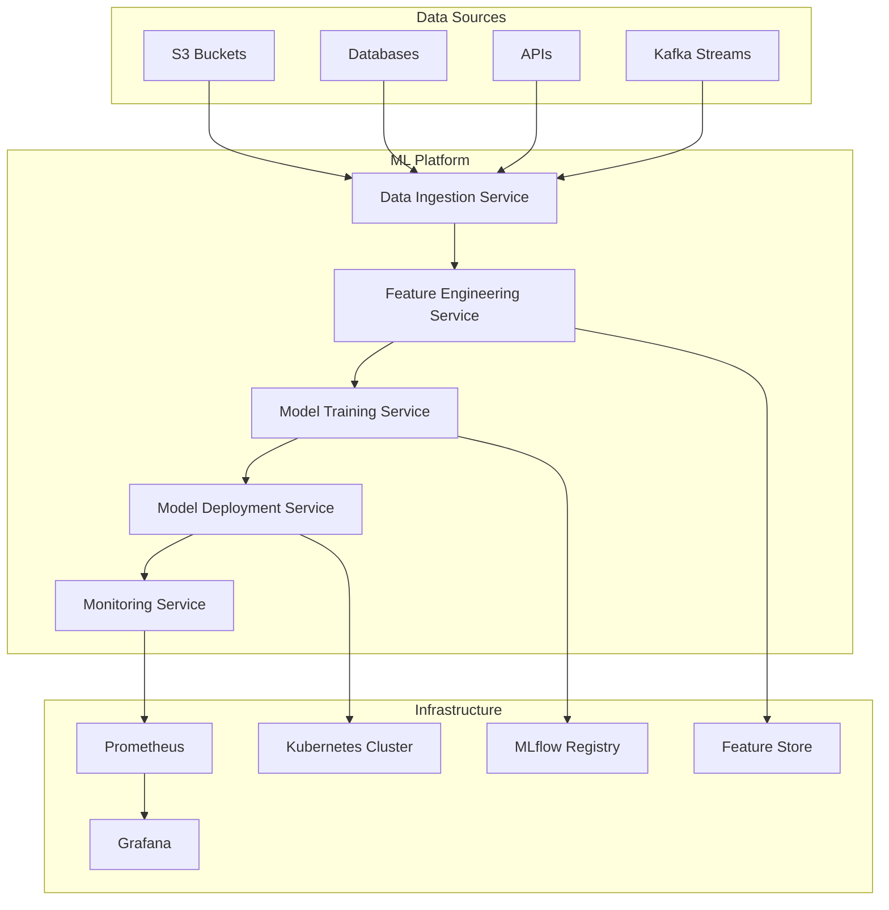

# Enterprise ML Platform

[](https://github.com/your-org/enterprise-ml-platform/actions) [](https://github.com/your-org/enterprise-ml-platform/actions) [](https://opensource.org/licenses/MIT) [](https://www.python.org/downloads/) [](https://hub.docker.com/r/your-org/enterprise-ml-platform) [](https://kubernetes.io/)

A comprehensive, production-ready machine learning platform designed for enterprise environments. This platform provides end-to-end MLOps capabilities including automated data ingestion, advanced feature engineering, distributed model training, multi-cloud deployment, and comprehensive monitoring.

## 🚀 Features

### **Core Capabilities**

- **🔄 Automated ML Pipeline** - End-to-end orchestration from data to deployment
- **📊 Multi-Source Data Ingestion** - S3, PostgreSQL, Kafka, APIs with parallel processing
- **🛠️ Advanced Feature Engineering** - Automated feature selection, transformation, and interaction discovery
- **🤖 Distributed Model Training** - XGBoost, LightGBM, ensemble methods with hyperparameter optimization
- **☁️ Multi-Cloud Deployment** - AWS SageMaker, GCP AI Platform, Azure ML, Kubernetes
- **📈 Comprehensive Monitoring** - Drift detection, performance monitoring, data quality assessment
- **🚨 Intelligent Alerting** - Multi-channel notifications (Email, Slack, PagerDuty, SMS)

### **Enterprise Features**

- **🔐 Security First** - Encryption, secrets management, audit trails
- **📏 Scalability** - Distributed processing, auto-scaling, resource optimization
- **🔍 Observability** - Structured logging, metrics, tracing, dashboards
- **🧪 Testing** - Unit, integration, performance, and end-to-end tests
- **📚 Documentation** - Comprehensive guides for users, developers, and operators
- **🔄 CI/CD Ready** - GitHub Actions, Docker, Kubernetes, Terraform integration

## 🏗️ Architecture



## 📁 Project Structure

```
enterprise-ml-platform/
├── 📄 README.md
├── 📄 LICENSE
├── 📄 .gitignore
├── 📄 pyproject.toml
├── 📄 setup.py
│
├── 🔧 .github/                          # GitHub workflows and templates
│   ├── workflows/
│   │   ├── ci.yml                       # Continuous Integration
│   │   ├── cd.yml                       # Continuous Deployment
│   │   ├── security-scan.yml            # Security scanning
│   │   └── dependency-update.yml        # Automated dependency updates
│   ├── ISSUE_TEMPLATE/                  # Issue templates
│   └── PULL_REQUEST_TEMPLATE.md         # PR template
│
├── 📦 requirements/                      # Python dependencies
│   ├── base.txt                         # Core dependencies
│   ├── development.txt                  # Development dependencies
│   ├── production.txt                   # Production dependencies
│   └── testing.txt                      # Testing dependencies
│
├── 🐳 docker/                           # Docker configurations
│   ├── Dockerfile.api                   # API service container
│   ├── Dockerfile.training              # Training service container
│   ├── Dockerfile.monitoring            # Monitoring service container
│   └── docker-compose.yml               # Local development stack
│
├── ☸️ kubernetes/                       # Kubernetes manifests
│   ├── namespaces/                      # Namespace definitions
│   ├── deployments/                     # Deployment manifests
│   ├── services/                        # Service definitions
│   ├── configmaps/                      # Configuration maps
│   ├── secrets/                         # Secret templates
│   └── monitoring/                      # Monitoring stack
│
├── 🏗️ terraform/                        # Infrastructure as Code
│   ├── environments/
│   │   ├── dev/                         # Development environment
│   │   ├── staging/                     # Staging environment
│   │   └── production/                  # Production environment
│   ├── modules/                         # Reusable Terraform modules
│   │   ├── vpc/                         # VPC module
│   │   ├── eks/                         # EKS cluster module
│   │   ├── rds/                         # RDS database module
│   │   └── s3/                          # S3 bucket module
│   └── main.tf                          # Main Terraform configuration
│
├── ⚙️ config/                           # Configuration files
│   ├── base.yaml                        # Base configuration
│   ├── development.yaml                 # Development overrides
│   ├── staging.yaml                     # Staging overrides
│   ├── production.yaml                  # Production overrides
│   └── logging.yaml                     # Logging configuration
│
├── 💻 src/                              # Source code
│   └── enterprise_ml_platform/
│       ├── 📁 core/                     # Core framework components
│       │   ├── pipeline_orchestrator.py # Main orchestration engine
│       │   ├── base_components.py       # Base classes and interfaces
│       │   ├── exceptions.py            # Custom exceptions
│       │   ├── logging_config.py        # Logging configuration
│       │   └── container.py             # Dependency injection container
│       │
│       ├── 🔧 services/                 # Business logic services
│       │   ├── 📥 data_ingestion/       # Data ingestion service
│       │   │   ├── service.py           # Main ingestion service
│       │   │   ├── connectors/          # Data source connectors
│       │   │   │   ├── s3_connector.py  # Amazon S3 connector
│       │   │   │   ├── postgres_connector.py # PostgreSQL connector
│       │   │   │   ├── kafka_connector.py # Kafka stream connector
│       │   │   │   └── api_connector.py # REST API connector
│       │   │   ├── validators/          # Data validation components
│       │   │   └── factories.py         # Factory classes
│       │   │
│       │   ├── 🛠️ feature_engineering/  # Feature engineering service
│       │   │   ├── service.py           # Main feature service
│       │   │   ├── transformers/        # Feature transformers
│       │   │   │   ├── numerical_transformer.py # Numerical features
│       │   │   │   ├── categorical_transformer.py # Categorical features
│       │   │   │   ├── temporal_transformer.py # Time-based features
│       │   │   │   └── composite_transformer.py # Complex features
│       │   │   ├── selectors/           # Feature selection algorithms
│       │   │   └── pipeline_stage.py    # Pipeline integration
│       │   │
│       │   ├── 🤖 model_training/       # Model training service
│       │   │   ├── service.py           # Main training service
│       │   │   ├── trainers/            # Algorithm-specific trainers
│       │   │   │   ├── xgboost_trainer.py # XGBoost implementation
│       │   │   │   ├── lightgbm_trainer.py # LightGBM implementation
│       │   │   │   ├── ensemble_trainer.py # Ensemble methods
│       │   │   │   └── neural_trainer.py # Neural networks
│       │   │   ├── optimization/        # Hyperparameter optimization
│       │   │   ├── explainability/      # Model explainability
│       │   │   └── pipeline_stage.py    # Pipeline integration
│       │   │
│       │   ├── 🚀 model_deployment/     # Model deployment service
│       │   │   ├── service.py           # Main deployment service
│       │   │   ├── deployers/           # Platform-specific deployers
│       │   │   │   ├── kubernetes_deployer.py # Kubernetes deployment
│       │   │   │   ├── sagemaker_deployer.py # AWS SageMaker
│       │   │   │   ├── gcp_deployer.py  # Google Cloud AI Platform
│       │   │   │   └── azure_deployer.py # Azure ML
│       │   │   ├── strategies/          # Deployment strategies
│       │   │   │   ├── blue_green.py    # Blue-green deployment
│       │   │   │   ├── canary.py        # Canary deployment
│       │   │   │   └── rolling.py       # Rolling deployment
│       │   │   └── pipeline_stage.py    # Pipeline integration
│       │   │
│       │   └── 📊 monitoring/           # Monitoring and observability
│       │       ├── service.py           # Main monitoring service
│       │       ├── drift_detection/     # Data/model drift detection
│       │       ├── performance/         # Performance monitoring
│       │       ├── data_quality/        # Data quality assessment
│       │       ├── alerting/            # Alert management
│       │       └── pipeline_stage.py    # Pipeline integration
│       │
│       ├── 🌐 api/                      # REST API service
│       │   ├── main.py                  # FastAPI application
│       │   ├── routers/                 # API route handlers
│       │   ├── dependencies.py          # Dependency injection
│       │   ├── middleware.py            # Custom middleware
│       │   └── schemas/                 # Pydantic schemas
│       │
│       ├── 💻 cli/                      # Command-line interface
│       │   ├── main.py                  # CLI entry point
│       │   ├── commands/                # CLI command implementations
│       │   └── utils.py                 # CLI utilities
│       │
│       └── 🛠️ utils/                    # Shared utilities
│           ├── config_loader.py         # Configuration management
│           ├── database.py              # Database utilities
│           ├── storage.py               # Storage abstractions
│           ├── encryption.py            # Encryption utilities
│           └── monitoring_utils.py      # Monitoring helpers
│
├── 🧪 tests/                            # Test suite
│   ├── conftest.py                      # PyTest configuration
│   ├── unit/                            # Unit tests
│   ├── integration/                     # Integration tests
│   ├── performance/                     # Performance tests
│   └── fixtures/                        # Test data and fixtures
│
├── 📚 docs/                             # Documentation
│   ├── architecture/                    # Architecture documentation
│   ├── user_guide/                      # User guides
│   ├── developer_guide/                 # Developer documentation
│   ├── operations/                      # Operations guides
│   └── examples/                        # Usage examples
│
├── 📜 scripts/                          # Automation scripts
│   ├── setup_dev_environment.sh         # Development setup
│   ├── build_docker_images.sh          # Docker build automation
│   ├── deploy_to_k8s.sh                # Kubernetes deployment
│   ├── run_tests.sh                     # Test execution
│   └── monitoring_setup.sh             # Monitoring stack setup
│
├── 📈 monitoring/                       # Monitoring configurations
│   ├── grafana/                         # Grafana dashboards
│   ├── prometheus/                      # Prometheus rules
│   └── alertmanager/                    # Alert manager config
│
├── 💡 examples/                         # Real-world examples
│   ├── fraud_detection/                 # Fraud detection pipeline
│   ├── recommendation_system/           # Recommendation system
│   └── time_series_forecasting/         # Time series forecasting
│
├── 🗄️ migrations/                       # Database migrations
│   ├── database/                        # Database schema migrations
│   └── model_registry/                  # Model registry migrations
│
└── 🔧 tools/                            # Development tools
    ├── data_generators/                 # Test data generators
    ├── model_converters/                # Model format converters
    └── performance_profilers/           # Performance profiling tools
```

## 🚀 Quick Start

### Prerequisites

- Python 3.9+
- Docker & Docker Compose
- Kubernetes cluster (optional)
- Cloud provider account (AWS/GCP/Azure) (optional)

### 1\. Clone and Setup

```bash
git clone https://github.com/your-org/enterprise-ml-platform.git
cd enterprise-ml-platform

# Setup development environment
./scripts/setup_dev_environment.sh
```

### 2\. Install Dependencies

```bash
# Install in development mode
pip install -e ".[dev]"

# Or using Poetry
poetry install --with dev
```

### 3\. Configure the Platform

```bash
# Copy and customize configuration
cp config/development.yaml.example config/development.yaml
# Edit config/development.yaml with your settings
```

### 4\. Start Local Development Stack

```bash
# Start supporting services (PostgreSQL, Redis, MLflow, etc.)
docker-compose up -d

# Run the platform
python -m enterprise_ml_platform.cli pipeline run --config config/development.yaml
```

### 5\. Access the Platform

- **API Documentation**: <http://localhost:8000/docs>
- **MLflow UI**: <http://localhost:5000>
- **Grafana Dashboard**: <http://localhost:3000> (admin/admin)
- **Prometheus Metrics**: <http://localhost:9090>

## 📖 Usage Examples

### Basic Pipeline Execution

```python
from enterprise_ml_platform.core.pipeline_orchestrator import CompleteMLPipelineOrchestrator

# Initialize pipeline with configuration
config = {
    "data_ingestion": {
        "sources": [
            {
                "name": "transactions",
                "type": "s3",
                "config": {"bucket": "ml-data", "prefix": "transactions/"}
            }
        ]
    },
    "model_training": {
        "algorithms": ["xgboost", "lightgbm"],
        "optimization": {"enabled": True, "trials": 100}
    },
    "deployment": {
        "platform": "kubernetes",
        "strategy": "blue_green"
    }
}

# Execute pipeline
orchestrator = CompleteMLPipelineOrchestrator(config)
results = await orchestrator.execute_complete_pipeline()
print(f"Pipeline completed: {results['overall_success']}")
```

### CLI Usage

```bash
# Run a complete pipeline
mlp pipeline run --config config/production.yaml --run-id prod-001

# Deploy a specific model
mlp deploy --model fraud-detector --version v1.2.0 --platform kubernetes

# Monitor model performance
mlp monitor --model fraud-detector --metrics accuracy,drift --dashboard

# Check system health
mlp health --detailed
```

### API Usage

```bash
# Start prediction service
curl -X POST "http://localhost:8000/api/v1/predict" \
  -H "Content-Type: application/json" \
  -d '{"features": {"amount": 100.0, "merchant": "store_123"}}'

# Get model metrics
curl "http://localhost:8000/api/v1/models/fraud-detector/metrics"

# Trigger pipeline
curl -X POST "http://localhost:8000/api/v1/pipelines/run" \
  -H "Content-Type: application/json" \
  -d '{"config_name": "production", "run_id": "api-001"}'
```

## 🏭 Production Deployment

### Kubernetes Deployment

```bash
# Build and push Docker images
./scripts/build_docker_images.sh

# Deploy to Kubernetes
kubectl apply -f kubernetes/namespaces/
kubectl apply -f kubernetes/deployments/
kubectl apply -f kubernetes/services/

# Setup monitoring
kubectl apply -f kubernetes/monitoring/
```

### AWS Deployment with Terraform

```bash
cd terraform/environments/production

# Initialize Terraform
terraform init

# Plan deployment
terraform plan -var-file="production.tfvars"

# Deploy infrastructure
terraform apply -var-file="production.tfvars"
```

### Multi-Cloud Setup

The platform supports deployment across multiple cloud providers:

- **AWS**: SageMaker, EKS, S3, RDS
- **Google Cloud**: AI Platform, GKE, Cloud Storage, Cloud SQL
- **Azure**: Machine Learning, AKS, Blob Storage, Azure SQL
- **On-Premises**: Kubernetes, MinIO, PostgreSQL

## 📊 Monitoring & Observability

### Metrics & Dashboards

- **Model Performance**: Accuracy, precision, recall, F1-score trends
- **Data Quality**: Completeness, validity, consistency, timeliness
- **Drift Detection**: Statistical and ML-based drift monitoring
- **System Health**: Resource usage, latency, throughput, errors
- **Business KPIs**: Custom metrics aligned with business objectives

### Alerting Channels

- **Email**: SMTP integration with customizable templates
- **Slack**: Rich notifications with actionable buttons
- **PagerDuty**: Integration for critical production alerts
- **SMS**: Twilio integration for urgent notifications
- **Webhooks**: Custom integrations with external systems

### Log Analytics

- **Structured Logging**: JSON-formatted logs with correlation IDs
- **Centralized Collection**: ELK Stack (Elasticsearch, Logstash, Kibana)
- **Real-time Analysis**: Log streaming and alerting
- **Audit Trail**: Complete pipeline execution tracking

## 🧪 Testing

### Run Test Suite

```bash
# Run all tests
pytest

# Run with coverage
pytest --cov=enterprise_ml_platform --cov-report=html

# Run specific test categories
pytest tests/unit/          # Unit tests
pytest tests/integration/   # Integration tests
pytest tests/performance/   # Performance tests

# Run tests in parallel
pytest -n auto
```

### Performance Testing

```bash
# Load testing for API
locust -f tests/performance/api_load_test.py --host http://localhost:8000

# Pipeline performance benchmarking
python tests/performance/pipeline_benchmark.py
```

## 🤝 Contributing

We welcome contributions! Please see our [Contributing Guide](docs/developer_guide/contributing.md) for details.

### Development Workflow

1. Fork the repository
2. Create a feature branch: `git checkout -b feature/amazing-feature`
3. Make your changes and add tests
4. Run the test suite: `pytest`
5. Commit your changes: `git commit -m 'Add amazing feature'`
6. Push to the branch: `git push origin feature/amazing-feature`
7. Open a Pull Request

### Code Standards

- **Python**: Follow PEP 8, use type hints, docstrings required
- **Testing**: Minimum 80% code coverage, tests required for new features
- **Documentation**: Update docs for any user-facing changes
- **Security**: Run security scans, no secrets in code

## 📄 License

This project is licensed under the MIT License - see the <LICENSE> file for details.

## 🆘 Support

### Documentation

- **Architecture**: <docs/architecture/>
- **User Guide**: <docs/user_guide/>
- **API Reference**: <docs/api/>
- **Troubleshooting**: <docs/user_guide/troubleshooting.md>

### Community

- **Issues**: [GitHub Issues](https://github.com/your-org/enterprise-ml-platform/issues)
- **Discussions**: [GitHub Discussions](https://github.com/your-org/enterprise-ml-platform/discussions)
- **Slack**: [Join our Slack](https://your-org.slack.com/channels/ml-platform)
- **Email**: ml-platform@your-org.com

### Enterprise Support

For enterprise support, custom implementations, or consulting services:

- **Email**: enterprise@your-org.com
- **Website**: <https://your-org.com/ml-platform-enterprise>
- **Phone**: +1-800-ML-PLATFORM

## 🚀 Roadmap

### Current Release (v2.0)

- ✅ Core pipeline orchestration
- ✅ Multi-cloud deployment support
- ✅ Advanced monitoring and alerting
- ✅ Comprehensive testing suite

### Next Release (v2.1) - Q2 2024

- 🔄 Real-time streaming pipelines
- 🔄 AutoML integration
- 🔄 Advanced A/B testing framework
- 🔄 Enhanced security features

### Future Releases

- 📋 MLOps marketplace for custom components
- 📋 Advanced interpretability dashboard
- 📋 Federated learning support
- 📋 Edge deployment capabilities

--------------------------------------------------------------------------------

## ⭐ Star History

[](https://star-history.com/#your-org/enterprise-ml-platform&Date)

--------------------------------------------------------------------------------

**Built with ❤️ for the ML community**
